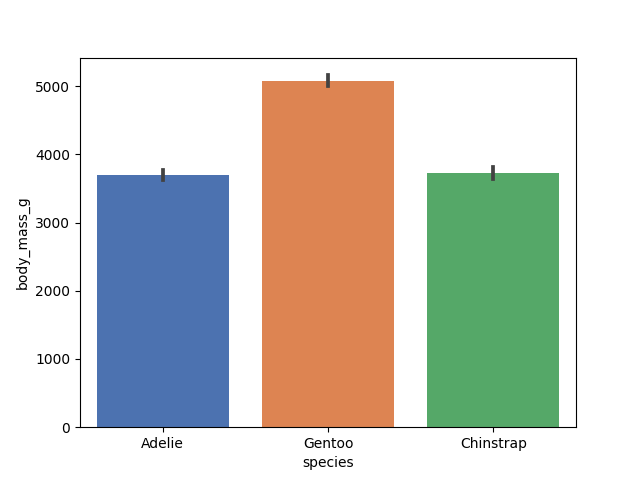
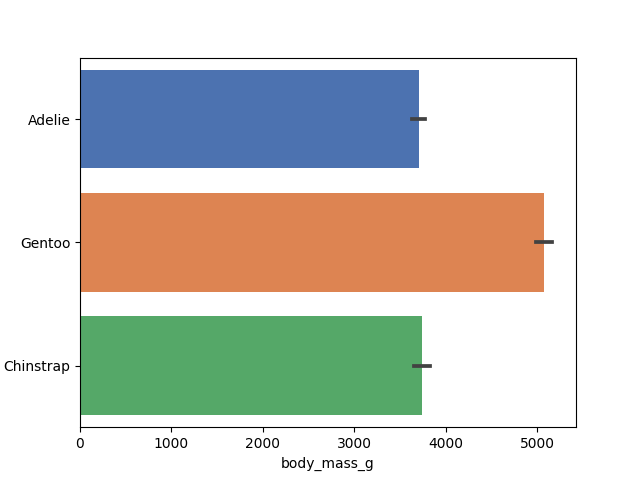
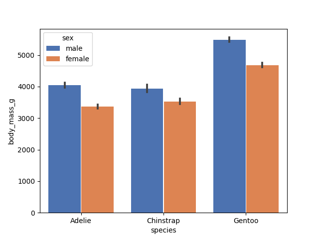
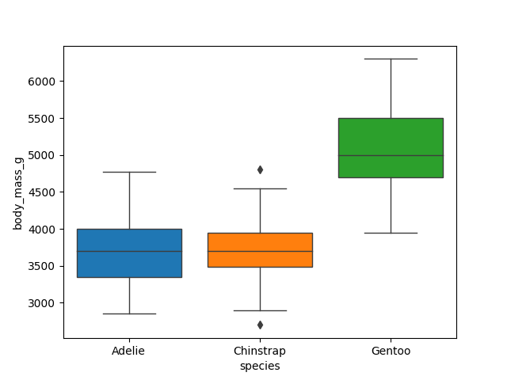
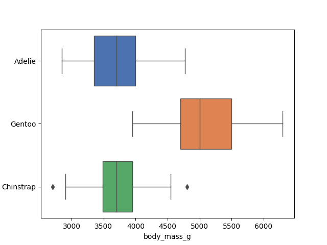
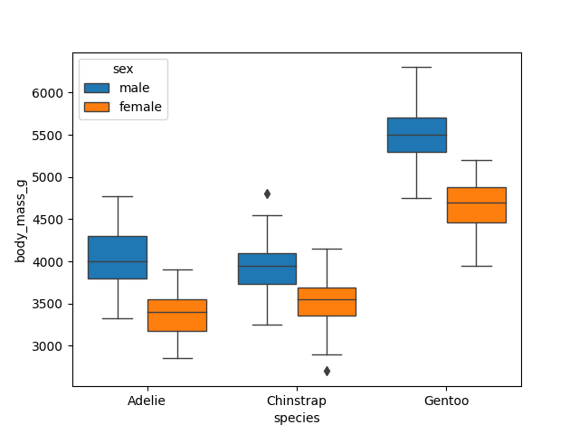
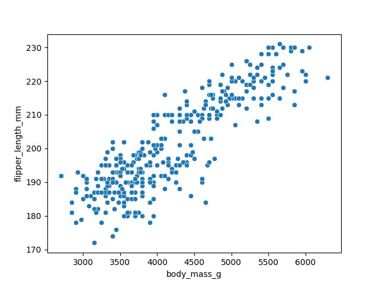
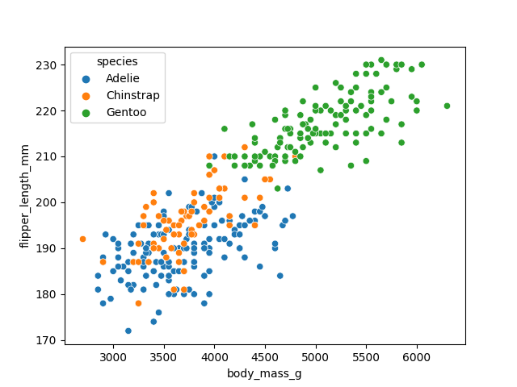
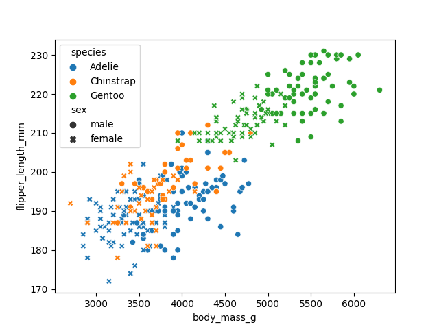

# Charty - Visualizing your data in Ruby


[](https://badge.fury.io/rb/charty)
[](https://mybinder.org/v2/gh/red-data-tools/charty/master?filepath=iris_dataset.ipynb)
[](https://rubydoc.info/gems/charty)

Charty is open-source Ruby library for visualizing your data in a simple way.
In Charty, you need to write very few lines of code for representing what you want to do.
It lets you focus on your analysis of data, instead of plotting.


## Installation

### MacOS:

```
$ brew install Python
$ pip3 install matplotlib
$ bundle
```

### Ubuntu + pyenv

You should install tk libraries before install python and should add enabling shared library option to installing python.
So you may have to do `pyenv uninstall 3.x.x` first.

```
$ apt install -y tk-dev python3-tk
$ CONFIGURE_OPTS="--enable-shared" pyenv install 3.x.x
```

### With Matplotlib

```
gem install charty --pre
gem install matplotlib
sudo apt install python3-pip
sudo python3 -m pip install -U pip matplotlib
```

## Development with Docker

e.g.

```
$ docker build -f ./Dockerfile.dev -t charty-dev:latest .
$ docker run --rm -v $(pwd):/charty charty-dev:latest bundle config set path vendor/bundle
$ docker run --rm -v $(pwd):/charty charty-dev:latest bundle install
$ docker run --rm -it -v $(pwd):/charty charty-dev:latest ./bin/console
irb(main):001:0> Charty::VERSION
=> "0.2.2"

# When using jupyter notebook
$ docker run --rm -it -v $(pwd):/charty -p 8888:8888 charty-dev:latest
```

## Usage

### Statistical plotting interface

Charty supports statistical plotting as Python's seaborn.

In the following examplles, we use the `penguins` dataset provided in red-datasets.

```ruby
require "datasets"

penguins = Datasets::Penguins.new
```

#### A basic workflow

The following code shows a basic workflow of the visualization with Charty.

First you need to load the Charty library.

```ruby
require "charty"
```

Next you msut have a dataset you want to visualize.  Here, we use the penguins dataset provided in red-datasets library.

```ruby
require "datasets"
penguins = Datasets::Penguins.new
```

Next you need to create a plotter object by a plotting method.  Here, we use `scatter_plot` method to show the relationship
among `body_mass_g`, `flipper_length_mm`, and `species` columns in the penguins dataset.

```ruby
plot = Charty.scatter_plot(data: penguins, x: :body_mass_g, y: :flipper_length_mm, color: :species)
```

If you want to render and save this plotter object into an HTML file by plotly backend, you can do it like below.

```ruby
Charty::Backends.use(:plotly)  # select plotly backend
plot.save("scatter.html")      # save the plot as  an HTML file
```

When you already have prepared [playwright-ruby-client](https://github.com/YusukeIwaki/playwright-ruby-client),
you can render a plot into a PNG file by plotly backend by specifying a filename with `.png` extension.

```ruby
plot.save("scatter.png")
```

#### Jupyter Notebook

If you use Charty on Jupyter Notebook with IRuby kerenl (a.k.a. IRuby notebook),
you can render the plot just evaluate a plotter object.  For example, the code below shows a scatter plot figure in
the output area.

```ruby
Charty::Backends.use(:plotly)

Charty.scatter_plot(data: penguins, x: :body_mass_g, y: :flipper_length_mm, color: :species)
```

Note that if you want to use the pyplot backend, you need to activate the integration between the pyplot backend and IRuby.
You can activate the integration by the following two lines.

```ruby
Charty::Backends.use(:pyplot)
Charty::Backends::Pyplot.activate_iruby_integration
```

#### Bar plot

Charty's statistical bar plot shows the relationship between a categorical variable and estimated means of a numeric variable.
This plot automatically calculates mean estimation and its 95% confidence interval of the numeric variable.

When we specify the categorical varaible as x-axis, the plot draws a vertical bar chart.
Instead, when we specify the categorical variable as y-axis, the plot draws a horizontal bar chart.

The following code shows the relationship between species and the mean body masses of penguins in a vertical bar chart.

```ruby
Charty.bar_plot(data: penguins, x: :species, y: :body_mass_g)
```



Exchanging x and y axes alternates the orientation of the resulting chart.

```ruby
Charty.bar_plot(data: penguins, x: :body_mass_g, y: :species)
```



Adding color axis introduces color grouping in the bar plot.

```ruby
Charty.bar_plot(data: penguins, x: :species, y: :body_mass_g, color: :sex)
```



#### Box plot

Charty's statistical box plot shows distributions of a numeric variable per categories.
The distributions are showed by boxes with whiskers that characterized by five-number summary.
This plot automatically calculates five-number summary the numeric variable per categories.

When we specify the categorical varaible as x-axis, the plot draws a vertical box plot chart.
Instead, when we specify the categorical variable as y-axis, the plot draws a horizontal box plot chart.

The following code draws a vertical box plot to show distributions of penguins' body mass per species.

```ruby
Charty.box_plot(data: penguins, x: :species, y: :body_mass_g)
```



As `bar_plot` above, exchanging x and y axes alternates the orientation of the resulting chart.

```ruby
Charty.box_plot(data: penguins, x: :body_mass_g, y: :species)
```



Adding color axis introduces color grouping in the box plot.

```ruby
Charty.box_plot(data: penguins, x: :species, y: :body_mass_g, color: :sex)
```



#### Scatter plot

Charty's scatter plot shows the relationship between two numeric variables.

```ruby
Charty.scatter_plot(data: penguins, x: :body_mass_g, y: :flipper_length_mm)
```



Adding color axis introduces color grouping in the scatter plot.
The following example specifies `:species` variable in the color axis.
It shows the different species by the different colors.

```ruby
Charty.scatter_plot(data: penguins, x: :body_mass_g, y: :flipper_length_mm, color: :species)
```



Moreover, size and style axes can be specified.
The following example specifies `:sex` variable in the style axis.

```ruby
Charty.scatter_plot(data: penguins, x: :body_mass_g, y: :flipper_length_mm, color: :species, style: :sex)
```



### Old-style plotting interface

```ruby
require 'charty'
charty = Charty::Plotter.new(:pyplot)

bar = charty.bar do
  series [0,1,2,3,4], [10,40,20,90,70], label: "sample1"
  series [0,1,2,3,4], [90,80,70,60,50], label: "sample2"
  series [0,1,2,3,4,5,6,7,8], [50,60,20,30,10, 90, 0, 100, 50], label: "sample3"
  range x: 0..10, y: 1..100
  xlabel 'foo'
  ylabel 'bar'
  title 'bar plot'
end
bar.render("sample_images/bar_pyplot.png")
```

Charty also supports Daru::DataFrame, Numo::NArray and ActiveRecord as Data Abstraction Layer.
For example.

```ruby
require 'charty'
charty = Charty::Plotter.new(:pyplot)


### when Daru::DataFrame
require 'daru'
df = Daru::DataFrame.new({'a':[1,2,3,4], 'b':[4,5,6,7], 'c':[8, 9, 10, 11]})
charty.table = df


### when Numo::NArray
require "numo/narray"
narray = Numo::DFloat.new(3,5).seq
charty.table = narray


### when ActiveRecord
require "active_record"
ActiveRecord::Base.establish_connection(adapter: "sqlite3", database: ":memory:")
ActiveRecord::Schema.define do
  create_table :foos do |t|
    t.integer :price
    t.integer :sales
  end
end
class Foo < ActiveRecord::Base
end
100.times{|i| Foo.create!(price: 10 * i, sales: (1..100).to_a.sample) }
sales = Foo.where("sales >= 40")
charty.table = sales


bar = charty.to_bar(:price, :sales)
bar.render('sample')

box_plot = charty.to_box_plot(:price, :sales)
box_plot.render('sample')

bubble = charty.to_bubble(:price, :sales, :id)
bubble.render('sample')

curve = charty.to_curve(:price, :sales)
curve.render('sample')

scatter = charty.to_scatter(:price, :sales)
scatter.render('sample')

error_bar = charty.to_error_bar(:price, :sales)
error_bar.render('sample')

hst= charty.to_hst(:price, :sales)
hst.render('sample')
```

## Examples

create an instance of the library you want to use.

```ruby
require 'charty'

# when you want to use matplotlib.pyplot
charty = Charty::Plotter.new(:pyplot)

# when you want to use gruff
charty = Charty::Plotter.new(:gruff)

# when you wanto to use rubyplot
charty = Charty::Plotter.new(:rubyplot)
```

### Bar

```ruby
bar = charty.bar do
  series [0,1,2,3,4], [10,40,20,90,70], label: "sample1"
  series [0,1,2,3,4], [90,80,70,60,50], label: "sample2"
  series [0,1,2,3,4,5,6,7,8], [50,60,20,30,10, 90, 0, 100, 50], label: "sample3"
  range x: 0..10, y: 1..100
  xlabel 'foo'
  ylabel 'bar'
  title 'bar plot'
end
bar.render("sample_images/bar_pyplot.png")
```

#### PyPlot


#### Gruff


#### Rubyplot


### Curve

```ruby
curve2 = charty.curve do
  series [0,1,2,3,4], [10,40,20,90,70], label: "sample1"
  series [0,1,2,3,4], [90,80,70,60,50], label: "sample2"
  series [0,1,2,3,4,5,6,7,8], [50,60,20,30,10, 90, 0, 100, 50], label: "sample3"
  range x: 0..10, y: 1..100
  xlabel 'foo'
  ylabel 'bar'
end
curve2.render("sample_images/curve_pyplot.png")
```

#### PyPlot


#### Gruff


#### Rubyplot


### Curve with function

```ruby
curve = charty.curve do
  function {|x| Math.sin(x) }
  range x: 0..10, y: -1..1
  xlabel 'foo'
  ylabel 'bar'
end
curve.render("sample_images/curve_with_function_pyplot.png")
```

#### PyPlot


#### Gruff

Not supported

#### Rubyplot


### Box plot

```ruby
box_plot = charty.box_plot do
  data [[60,70,80,70,50], [100,40,20,80,70], [30, 10]]
  range x: 0..10, y: 1..100
  xlabel 'foo'
  ylabel 'bar'
  title 'box plot'
end
box_plot.render("sample_images/box_plot_pyplot.png")
```

#### PyPlot


#### Gruff

Not supported

#### Rubyplot

Not supported

### Scatter

```ruby
scatter = charty.scatter do
  series 0..10, (0..1).step(0.1), label: 'sample1'
  series 0..5, (0..1).step(0.2), label: 'sample2'
  series [0, 1, 2, 3, 4], [0, -0.1, -0.5, -0.5, 0.1], label: 'sample3'
  range x: 0..10, y: -1..1
  # xlabel 'x label'
  # xlabel ''
  ylabel 'y label'
  title 'scatter sample'
end
scatter.render("sample_images/scatter_pyplot.png")
```

#### PyPlot


#### Gruff


#### Rubyplot


### Errorbar

```ruby
error_bar = charty.error_bar do
  series [1,2,3,4], [1,4,9,16], xerr: [0.5,1.0,1.5,0.3], yerr: [0.6,0.2,0.8,0.1], label: 'label1'
  series [1,2,3,4], [16,9,4,1], label: 'label2'
  series [1,2,3,4,5,6,7,8], [14,14,14,14,14,14,14,14], label: 'label2', xerr: [0.5,1.0,1.5,0.3, 1.1, 1.2, 1.3, 1.4]
  range x: 0..10, y: -1..20
  xlabel 'x label'
  title 'error_bar'
end
error_bar.render("sample_images/error_bar_pyplot.png")
```

#### PyPlot


#### Gruff

Not supported

#### Rubyplot

Not supported

### Bubble chart

```ruby
bubble = charty.bubble do
  series 0..10, (0..1).step(0.1), [10, 100, 1000, 20, 200, 2000, 5, 50, 500, 4, 40], label: 'sample1'
  series 0..5, (0..1).step(0.2), [1, 10, 100, 1000, 500, 100], label: 'sample2'
  series [0, 1, 2, 3, 4], [0, -0.1, -0.5, -0.5, 0.1], [40, 30, 200, 10, 5]
  range x: 0..10, y: -1..1
  xlabel 'x label'
  ylabel 'y label'
  title 'bubble sample'
end
bubble.render("sample_images/bubble_pyplot.png")
```

#### PyPlot


#### Gruff

Not supported

#### Rubyplot


### Histogram

```ruby
hist = charty.hist do
  data [[10, 10, 20, 30, 40, 40,40,40,40,40, 50, 10, 10, 10], [100, 100, 100, 100, 90, 90, 80, 30, 30, 30, 30, 30]]
  range x: 0..100, y: 0..7
  xlabel 'x label'
  ylabel 'y label'
  title 'histogram sample'
end
hist.render("sample_images/hist_pyplot.png")
```

#### PyPlot


#### Gruff


#### Rubyplot

Not supported

### Subplots

```ruby
layout = charty.layout
layout << curve
layout << scatter
layout.render("sample_images/subplot_pyplot.png")
```

#### PyPlot


#### Gruff

Not supported

#### Rubyplot

Not supported

### Subplots 2

```ruby
curve_list = [0.5, 0.75].map do |f|
  charty.curve(f:f) do
    function {|x| Math.sin(f*x) }
    range x: 0..10, y: -1..1
  end
end

scatter_list = [-0.5, 0.5].map do |f|
   charty.scatter(f: f) do
    series Charty::Linspace.new(0..10, 20), Charty::Linspace.new(0..f, 20)
    range x: 0..10, y: -1..1
  end
end

grid_layout = charty.layout(:grid2x2)
grid_layout << curve_list
grid_layout << scatter_list
grid_layout.render("sample_images/subplot2_pyplot.png")
```

#### PyPlot


#### Gruff

Not supported

#### Rubyplot

Not supported


## Acknowledgements

- The concepts of this library is borrowed from Python's [HoloViews](http://holoviews.org/) and Julia's [Plots ecosystem](https://juliaplots.github.io/).

## Authors

- Kenta Murata \<mrkn@mrkn.jp\>
- Kazuma Furuhashi \<k.furuhashi10@gmail.com\>

## License

MIT License
